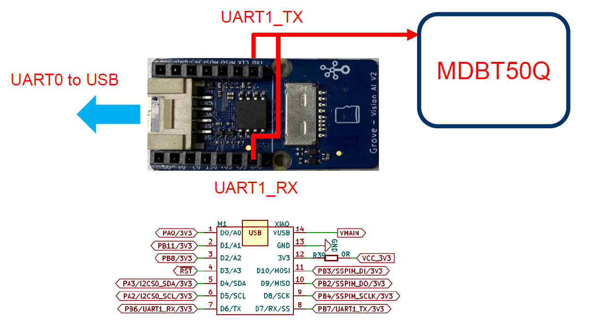
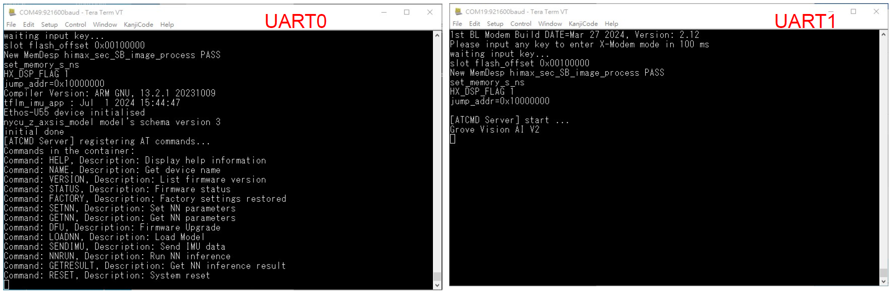

## TFLM_IMU_APP supports ATCMD server
### This example initializes UART1 communication with the MDBT50Q and configures the ATCMD server to receive AT commands. The following AT commands are supported.

- Command terminator : "\r" (0x0d)
   ex. "AT+HELP\r"

### Grove Vision AI Module V2 UART1 connected to MDBT50Q
- Grove Vision AI Module V2
    
    

### INPUT :
    AT+HELP
### OUTPUT :
    AT+HELP : Display help information
    AT+NAME : Get device name
    AT+VERSION : List firmware version
    AT+STATUS : Firmware status
    AT+FACTORY : Factory settings restored
    AT+SETNN : Set NN parameters
    AT+GETNN : Get NN parameters
    AT+DFU : Firmware Upgrade
    AT+LOADNN : Load Model
    AT+SENDIMU : Send IMU data
    AT+NNRUN : Run NN inference
    AT+GETRESULT : Get NN inference result
    AT+RESET : System reset

### INPUT :
    AT+NAME
### OUTPUT :
    Grove Vision AI V2

### INPUT :
    AT+VERSION
### OUTPUT :
    Firmware version : 1.0

### INPUT :
    AT+STATUS
### OUTPUT :
    Firmware status : Running

### INPUT :
    AT+FACTORY
### OUTPUT :
    Factory settings restored

### INPUT :
    AT+SETNN=1,2,3,4,5
### OUTPUT :
    SETNN=1,2,3,4,5

### INPUT :
    AT+GETNN
### OUTPUT :
    GETNN=1,2,3,4,5

### INPUT :
    AT+SENDIMU=012f,ff0b,1031,014b,fede,0ff3,0126,ff75,1004,0126,ff8a,1010,0133,ff92,0ffb,013b,ff92,0ff7,0126,ff9a,1004,013f,ff9a,0fdf,011a,ff96,0fe7,010a,ff8e,0ffb,00e9,ff8e,1010,00cc,ff82,1035,00c8,ff92,1000,00b0,ff92,100c,00a3,ff92,1008,0087,ff96,1020,0072,ff9e,1020,008b,ff9e,1000,0076,ff8e,1014,0051,ff96,101c,006e,ff92,1004,006a,ff9a,0ff7,0051,ff82,1014,0051,ff92,0ffb,0041,ff96,100c,0049,ff92,0ff7,0020,ff96,1014,0014,ff96,1010,fffc,ff96,1020,0004,ff9a,1014,0010,ff92,100c,0014,ff92,100c,0028,ff8e,1004,001c,ff92,1004,0024,ff96,1004,002d,ff9a,1004,001c,ff96,1010,0014,ff92,1008,0018,ff96,1008,0010,ff96,1010,0014,ff92,1014,001c,ff92,1008,0018,ff92,100c,0020,ff8e,1008,0020,ff92,100c,0024,ff96,100c,0024,ff92,1004,0020,ff96,1010,0028,ff8e,1010,0020,ff8a,1008,0028,ff92,1010,0018,ff8a,100c,0020,ff92,1010,0020,ff92,1004,0020,ff96,1004,0010,ff92,1010,001c,ff8e,100c,0018,ff96,1008,0014,ff8e,1008,0018,ff96,100c,0010,ff92,1008,0010,ff9e,1000,0010,ff96,1008,0014,ff96,1008,0008,ff92,1010,0014,ff92,1014,000c,ff9a,1008,000c,ff92,100c,001c,ff7d,1018,0008,ff8e,1018,fff8,ff9e,1008,fff4,ff9a,1010,0004,ff8e,100c,0010,ff96,1008,0014,ff8e,100c,000c,ff92,1004,000c,ff8e,1008,000c,ff8e,1010,000c,ff8e,1008,0014,ff92,100c,0018,ff96,100c,0014,ff96,1008,0024,ff92,1008,002d,ff92,1000,0020,ff96,100c,0031,ff96,1004,0031,ff92,1004,0028,ff92,1010,0024,ff92,1008,001c,ff92,1008,0018,ff92,1010,0018,ff92,1010,0018,ff8e,100c,0020,ff96,1004,0024,ff92,100c,0028,ff92,1004,0024,ff96,100c,0035,ff8e,1004,0024,ff92,0ff7,0049,ff9e,0fdf,ffdc,ff54,1087,0000,febd,121c,00d9,027e,1be3,ffbf,01a9,1b70,002d,0153,1cd0,0004,01eb,1e45,ffd8,0185,1e83,ffd8,01e3,1fca,003d,0147,2000,fff0,0133,1f74,ff79,0239,1b70,ffee,029f,15df,fe52,02f5,1020,fdb3,0389,0c35,feb9,0262,0a08,ff27,004d,0553,ff79,fecd,00e1,0031,ff2c,0220,0056,0051,0512,00d0,ff7d,047e,015c,fe6b,029b,01b6,fdd8,0266,020c,fe25,04cc,033f,fd69,0831,0399,fc84,08f9,0360,fcee,09a9,0358,fd75,0b4b,0391,fd61,0c51

### OUTPUT : 
    SENDIMU=384 (Number of IMU data buffer)

### INPUT :
    AT+NNRUN
### OUTPUT :
    AT+NNRUN

### INPUT :
    AT+GETRESULT
### OUTPUT :
    GETRESULT=127,-128,-128 (WE2 output[0]:0.9960, output[1]:0.0000, output[2]:0.0000, estimate label: 0)

### INPUT : 
    AT+SENDIMU=023d,ffdc,0fe7,0239,ffbb,0fce,0241,ffc3,0241,ffc7,0fdb,0239,ffd3,0fd2,0231,ff00,0ff3,022d,ffe0,0fdf,0249,ffbf,0ff3,0241,ffc3,0ffb,0245,ffcf,0241,1024,ffcb,1041,0249,ffaa,101c,0251,ff9e,0fdb,0251,ffbb,0fdb,023d,fffa,0fca,0245,ffdc,0fba,0251,ffd8,0fce,025e,ffc7,0fd7,0262,ffb3,0fd2,0256,ffb7,0fd7,0241,ff00,0ff3,0245,ffcb,0fe3,0251,ffa6,0fe3,0245,ffcf,0fef,0239,ffcb,1004,0235,ffbb,1000,023d,ff9e,0ff7,024d,ff86,0ff7,0239,ff92,0fd7,0239,ffb3,100c,0228,ffc7,1008,0231,ffb3,1004,0245,ff9e,1010,0251,ff8a,0ffb,024d,ffa2,0ff3,023d,ffaa,0feb,0220,ffbf,0feb,0241,ffa2,1010,026a,ff65,1008,0262,ff69,0fd2,026e,ff6d,0fd2,0272,ff69,0fbe,0266,ff71,0f8d,026a,ff82,0f99,026a,ff96,0fbe,0239,ff9e,0fb2,023d,ffa2,0fe3,0251,ff7d,0fe3,0262,ff54,0fce,0262,ff54,100c,0251,ff6d,1041,023d,ff59,1024,0245,ff6d,102d,0231,ff96,100c,0245,ff71,0fce,027a,ff3c,0fba,0287,ff48,0fef,026a,ff82,0fef,0256,ff86,0fbe,0241,ffa2,0fd2,0245,ff9a,0fd2,0245,ff96,0fc2,0245,ffa2,0fdb,0256,ff96,100c,0272,ff59,1018,026e,ff48,1000,0245,ff86,1010,022d,ff9a,1010,0235,ff96,1018,0249,ff71,0feb,025a,ff59,0fd2,025a,ff54,0fce,025a,ff69,0ff7,025a,ff69,0feb,0249,ff65,0fdb,0249,ff6d,0ff7,0241,ff69,0ff3,0231,ff6d,0fd7,023d,ff7d,1000,0241,ff5d,100c,0251,ff44,1020,0256,ff50,101c,0235,ff7d,0ff3,0241,ff65,0fe3,025e,ff54,0ff7,0251,ff75,0ff3,0249,ff75,0fdb,0276,ff40,0ff7,0245,ff69,0f91,0245,ff6d,0f81,0249,ff69,0fa5,024d,ff40,0f95,025a,ff1b,0f74,024d,ff0f,0f2b,0214,ff0b,0ecc,01db,ff23,0e4d,0164,ff82,0dae,00ed,000e,0ced,fff8,0174,0ad9,ffea,025e,0845,ffec,0358,03eb,ff88,022d,feb1,ffcf,0428,fb4c,fd8a,0570,fa3e,fe32,0326,f70b,fe5f,0276,f6f6,fee6,02f1,087a,0087,fe4e,1ca3,0360,f8b1,2000,053b,f954,2000,04c0,fcc5,2000,034f,00ed,2000,0231,01e7,1e56,0147,01ef,17ef,0008,0251,1497,ff71,0249,13f3,fef6,0185,1410,ff17,016c,15d7,fef6,00d9,1449,fec1,0106,12d4,fe84,017c,1102,fe8c,01ce,10b0,fec9,0102,10fd,ff48,008f,124d,ff75,008b,12ac,ff3c,0083,10bc,feda,013b,0fba,fe4a,01ae,0f58,0000

### OUTPUT :
    SENDIMU=384\r" (Number of IMU data buffer)

### INPUT :
    AT+NNRUN
### OUTPUT :
    AT+NNRUN

### INPUT :
    AT+GETRESULT
### OUTPUT :
    GETRESULT=-128,127,-128 (WE2 output[0]:0.0000, output[1]:0.9960, output[2]:0.0000, estimate label: 1)

### INPUT :
    AT+SENDIMU=0066,ff82,1004,005e,ff7d,100c,0062,ff82,1010,0062,ff82,100c,005e,ff7d,100c,005a,ff82,100c,0062,ff82,100c,0066,ff82,1014,0062,ff82,1010,0066,ff79,1010,0062,ff82,100c,0062,ff82,100c,0062,ff82,100c,0066,ff7d,1010,0066,ff86,100c,005a,ff82,1008,0062,ff86,100c,005e,ff82,1004,005e,ff7d,1008,005e,ff82,1010,0062,ff7d,100c,0062,ff7d,1010,0066,ff79,100c,005a,ff82,100c,005a,ff7d,1010,005a,ff82,100c,005e,ff82,100c,005e,ff82,1010,005e,ff7d,100c,0062,ff7d,100c,0062,ff7d,1004,005e,ff79,100c,0062,ff82,1004,0066,ff86,100c,0062,ff7d,100c,0062,ff82,100c,0062,ff82,1008,0062,ff7d,100c,0062,ff7d,100c,0066,ff7d,100c,005e,ff7d,100c,005e,ff86,1008,0062,ff86,1008,005a,ff8a,1010,0062,ff82,100c,0062,ff79,1008,005e,ff82,1010,0062,ff7d,1004,0066,ff82,1008,0062,ff82,1010,0062,ff82,1010,0062,ff86,1010,0066,ff86,100c,0062,ff82,100c,005a,ff82,1014,0062,ff82,100c,0062,ff82,1004,0066,ff82,1008,005e,ff7d,100c,0062,ff7d,1000,0062,ff7d,1000,005e,ff86,100c,005e,ff82,100c,0062,ff7d,1008,005e,ff82,1010,0062,ff82,100c,0062,ff7d,1010,005e,ff82,100c,0062,ff82,100c,0062,ff82,1008,005e,ff7d,100c,005e,ff82,1014,005a,ff82,1008,005e,ff86,1014,0066,ff82,1008,0062,ff7d,100c,0066,ff7d,1008,0066,ff79,1008,0062,ff86,1010,005e,ff82,1004,005e,ff86,1004,005e,ff82,1010,0066,ff7d,1008,0062,ff7d,1010,0062,ff82,1008,005e,ff82,100c,005e,ff7d,100c,005a,ff82,1008,005e,ff7d,100c,005e,ff82,1008,005e,ff82,1008,0062,ff82,1000,0062,ff7d,1008,0062,ff82,1010,0066,ff82,1008,0062,ff7d,1008,0066,ff7d,1010,0062,ff82,1008,0062,ff7d,1010,0062,ff82,1008,0066,ff7d,1008,0062,ff82,1004,005e,ff82,1008,005e,ff82,100c,0062,ff82,1004,0062,ff82,100c,0066,ff7d,100c,0062,ff82,1008,0062,ff82,1008,005e,ff7d,1004,005e,ff7d,100c,005e,ff86,1008,005e,ff7d,1004,006a,ff7d,100c,005e,ff82,1004,005e,ff82,1000,0062,ff7d,1008,005e,ff82,100c,0066,ff82,1008,0062,ff7d,100c,0062,ff86,1010,0062,ff82,1008,0062,ff82,1008,0062,ff7d,100c,005a,ff86,100c,0062,ff82,1010,005a,ff8a,100c,0062,ff82,1010
### OUTPUT :
    SENDIMU=384 (Number of IMU data buffer)

### INPUT :
    AT+NNRUN
### OUTPUT :
    AT+NNRUN

### INPUT :
    AT+GETRESULT
### OUTPUT :
    GETRESULT=-93,-93,58 (WE2 output[0]:0.1367, output[1]:0.1367, output[2]:0.7265, estimate label: 2)

### INPUT :
    AT+DFU
### OUTPUT :
    Jump to Xmodem firmware/model download mode
    ------------------------------------------------------------
    [0] Reboot system
    [1] Xmodem download and burn FW image
    [2] Debug mode, switch TXD(PB7) to SWDCLK, D2(PB8) to SWDIO
    ------------------------------------------------------------

### INPUT :
    AT+LOADNN=1,gesture model,200000
### OUTPUT
    Jump to Xmodem firmware/model download mode
    ------------------------------------------------------------
    [0] Reboot system
    [1] Xmodem download and burn FW image
    [2] Debug mode, switch TXD(PB7) to SWDCLK, D2(PB8) to SWDIO
    ------------------------------------------------------------

### INPUT :
    AT+RESET
### OUTPUT :
    [ATCMD Server] start ... (System reset)

## How to build TFLM_IMU_APP and run on WE2?
### Linux Environment
- Change the `APP_TYPE` to `tflm_imu_app` at [makefile](https://github.com/HimaxWiseEyePlus/HIMAX_WE2_Rabboni/blob/main/EPII_CM55M_APP_S/makefile)
    ```
    APP_TYPE = tflm_imu_app
    ```
- Build the firmware reference the part of [Build the firmware at Linux environment](https://github.com/HimaxWiseEyePlus/HIMAX_WE2_Rabboni?tab=readme-ov-file#build-the-firmware-at-linux-environment)

- Compile the firmware
- Generate firmware image file
- Flash the firmware to Grove Vision AI V2

### Burn prebuild ATCMD server firmware image tflm_imu_app.img and model into flah
- change directory to "HIMAX_WE2_Rabboni"
    ```
    python xmodem\xmodem_send.py --port=COM3 --baudrate=921600 --protocol=xmodem --file=tflm_imu_app.img --model="model_zoo\tflm_imu_app\cnn_model_zaxis-1_vela_0x200000.tflite 0x200000 0x00000"
    ```
### Burn user's tflm_imu_app.img and model into flash
- change directory to "SHIMAX_WE2_Rabboni"
    ```
    python xmodem\xmodem_send.py --port=COM3 --baudrate=921600 --protocol=xmodem --file=we2_image_gen_local\output_case1_sec_wlcsp\output.img --model="model_zoo\tflm_imu_app\cnn_model_zaxis-1_vela_0x200000.tflite 0x200000 0x00000"
    ```
hint1: COM3 should be change by [your COM number]
hint2: 0x200000 is the model position which sets on ~\EPII_CM55M_APP_S\app\scenario_app\tflm_imu_app\common_config.h L25